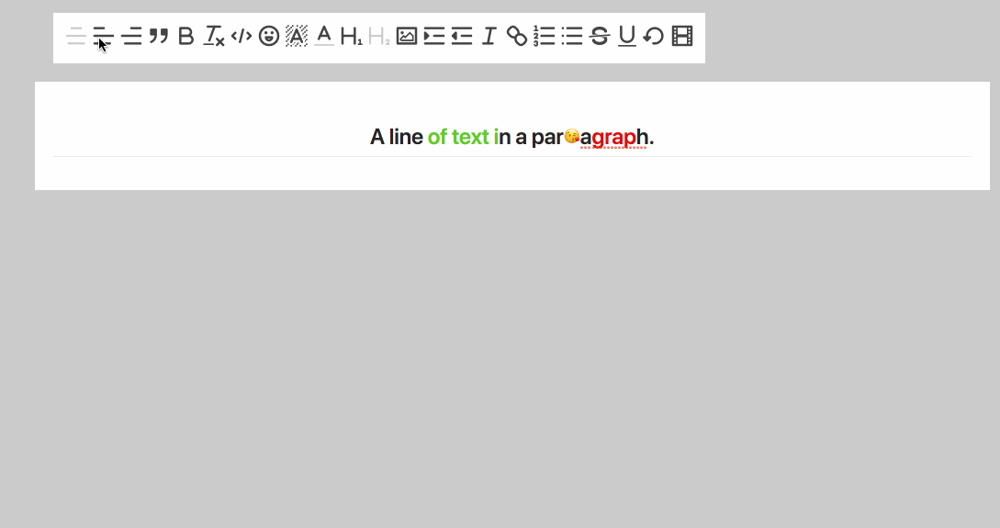

# slate-editor-icons

> Shared icons and render functions for slate editors, icons are extracted from [Quill editor](https://quilljs.com/) (see [quill-icons](https://github.com/Canner/quill-icons) for more information)



## Usage

This project is maintain in a monorepo, see packages in `packages` folder

Install icons that you want to support in your slate project, and pass slate editor `change (value.change())` and `onChange` function as props into the component. When users click these icons it will apply changes and trigger onChange function to update new change to your editor.

You will need to pass icon classnames as props into your components ([supported classes](https://github.com/Canner/quill-icons#props)), you could look at the example [how to setup your icon's styles](https://github.com/Canner/slate-editor-icons/blob/master/docs/style.css) 

```js
class App extends React.Component {
  // Set the initial state when the app is first constructed.
  state = {
    value: initialValue // your slate editor's initial value
  }

  render() {
    const {value} = this.state;
    const onChange = ({value}) => this.setState({value});

    return (
      <div style={{margin: '50px'}}>
        <div className="toolbar">
          {icons.map((Type, i) => {
            return <Type
              change={value.change()}
              onChange={onChange}
              key={i}
              className="toolbar-item"
              activeClassName="toolbar-item-active"
              activeStrokeClassName="ql-stroke-active"
              activeFillClassName="ql-fill-active"
              activeThinClassName="ql-thin-active"
              activeEvenClassName="ql-even-active"
            />
          })}
        </div>
        <div className="editor markdown-body">
          <Editor
            value={value}
            onChange={onChange}
            plugins={plugins}
            renderNode={renderNode}
            renderMark={renderMark}
          />
        </div>
      </div>
    );
  }
}
```


The best explanation is a simple example: https://github.com/Canner/slate-editor-icons/blob/master/docs/index.js

## Icon Props

All icons must passed these two props to ensure working properly.

| **props** | **type** | **required** | **default** | **description**  |
|-----------|----------|--------------|-------------|------------------|
| change     | object   | true        | null          | changes to value |
| onChange  | func   | true         | null         | onChange function usually `change => this.setState({value})` to update slate state  |


## Icon packages

### @canner/slate-icon-align

Export components:

- AlignCenter
- AlignLeft
- AlignRight

```js
import {AlignCenter, AlignLeft, AlignRight} from '@canner/slate-icon-align';
```

### @canner/slate-icon-blockquote

```js
import Blockquote from '@canner/slate-icon-blockquote';
```

### @canner/slate-icon-bold

```js
import Bold from '@canner/slate-icon-bold';
```

### @canner/slate-icon-clean

```js
import Clean from '@canner/slate-icon-clean';
```

### @canner/slate-icon-code

```js
import Code from '@canner/slate-icon-code';
```

### @canner/slate-icon-emoji

```js
import Emoji from '@canner/slate-icon-emoji';
```

### @canner/slate-icon-fontBgColor

```js
import FontBgColor from '@canner/slate-icon-fontbgcolor';
```

### @canner/slate-icon-fontColor

```js
import FontColor from '@canner/slate-icon-fontcolor';
```

### @canner/slate-icon-header

Export components: 
  - Header1
  - Header2

```js
import {Header1, Header2} from '@canner/slate-icon-header';
```

### @canner/slate-icon-image

```js
import Image from '@canner/slate-icon-image';
```

### @canner/slate-icon-indent

Export components:
  - Indent
  - Outdent

```js
import {Indent, Outdent} from '@canner/slate-icon-indent';
```

### @canner/slate-icon-italic

```js
import Italic from '@canner/slate-icon-italic';
```

### @canner/slate-icon-link

```js
import Link from '@canner/slate-icon-link';
```

### @canner/slate-icon-list

Export components:
  - OlList
  - UlList

```js
import {OlList, UlList} from '@canner/slate-icon-list';
```

### @canner/slate-icon-strikethrough

```js
import Strikethrough from '@canner/slate-icon-strikethrough';
```

### @canner/slate-icon-underline

```js
import Underline from '@canner/slate-icon-underline';
```

### @canner/slate-icon-undo

```js
import Undo from '@canner/slate-icon-undo';
```

### @canner/slate-icon-video

```js
import Video from '@canner/slate-icon-video';
```

### @canner/slate-icon-renderer

Renderers that define corresponding nodes and marks while rendering your editor.


## Start example server

```
npm start
```

## Maintainer

[chilijung](https://github.com/chilijung)

## License

MIT © [Canner](https://github.com/Canner)
