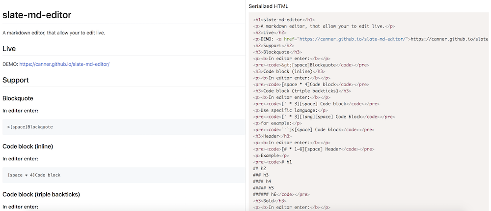

# slate-editor-icons

> Shared icons and render functions for slate editors, icons are extracted from [Quill editor](https://quilljs.com/) (see [quill-icons](https://github.com/Canner/quill-icons) for more information)

Live demo: https://canner.github.io/slate-editor-icons/

Editors that build on top of these icons:

- https://github.com/Canner/slate-toolbar
- https://github.com/Canner/canner-slate-editor

Supported features:

- [Align](#cannerslate-icon-align) - center, left, right
- [Blockquote](#cannerslate-icon-blockquote)
- [Bold](#cannerslate-icon-bold)
- [Clean](#cannerslate-icon-clean)
- [Code](#cannerslate-icon-code)
- [Emoji](#cannerslate-icon-emoji)
- [Font background color](#cannerslate-icon-fontbgcolor)
- [Font color](#cannerslate-icon-fontcolor)
- [Header](#cannerslate-icon-header) - header 1, header 2
- [Image](#cannerslate-icon-image)
- [Indent](#cannerslate-icon-indent) - indent, outdent
- [Italic](#cannerslate-icon-italic)
- [Link](#cannerslate-icon-link)
- [List](#cannerslate-icon-list) - Ol list, Ul list
- [Strike through](#cannerslate-icon-strikethrough)
- [Underline](#cannerslate-icon-underline)
- [Undo](#cannerslate-icon-undo)
- [Video](#cannerslate-icon-video)

Supported selectors:

- [Font size](#cannerslate-icon-fontsize)
- [Line height](#cannerslate-icon-lineheight)
- [Letter spacing](#cannerslate-icon-letterspacing)



## Usage

This project is maintain in a monorepo, see packages in `packages` folder

Install icons that you want to support in your slate project, and pass slate editor `change (value.change())` and `onChange` function as props into the component. When users click these icons it will apply changes and trigger onChange function to update new change to your editor.

**NOTE: You have to add corresponding plugins to your editor!**

You will need to pass icon classnames as props into your components ([supported classes](https://github.com/Canner/quill-icons#props)), you could look at the example [how to setup your icon's styles](https://github.com/Canner/slate-editor-icons/blob/master/docs/style.css) 

```js
class App extends React.Component {
  // Set the initial state when the app is first constructed.
  state = {
    value: initialValue // your slate editor's initial value
  }

  render() {
    const {value} = this.state;
    const onChange = ({value}) => this.setState({value});

    return (
      <div style={{margin: '50px'}}>
        <div className="toolbar">
          {icons.map((Type, i) => {
            return <Type
              change={value.change()}
              onChange={onChange}
              key={i}
              className="toolbar-item"
              activeClassName="toolbar-item-active"
              activeStrokeClassName="ql-stroke-active"
              activeFillClassName="ql-fill-active"
              activeThinClassName="ql-thin-active"
              activeEvenClassName="ql-even-active"
            />
          })}
        </div>
        <div className="editor markdown-body">
          <Editor
            value={value}
            onChange={onChange}
            plugins={plugins} // ----> use corresponding plugins of your selected icons, for example `Bold` icon use `BoldPlugin`
          />
        </div>
      </div>
    );
  }
}
```


The best explanation is a simple example: https://github.com/Canner/slate-editor-icons/blob/master/docs/index.js

## Icon and selectors' props

All icons must passed these two props to ensure working properly.

| **props** | **type** | **required** | **default** | **description**  |
|-----------|----------|--------------|-------------|------------------|
| change     | object   | true        | null          | changes to value |
| onChange  | func   | true         | null         | onChange function usually `change => this.setState({value})` to update slate state  |


## Icon packages

### @canner/slate-icon-align

Export components:

- AlignCenter
- AlignLeft
- AlignRight

```js
import {AlignCenter, AlignLeft, AlignRight} from '@canner/slate-icon-align';
```

**Plugin:**

```js
import {ParagraphPlugin} from '@canner/slate-icon-shared';
```

### @canner/slate-icon-blockquote

**Icon:**

```js
import Blockquote from '@canner/slate-icon-blockquote';
```

**Plugin:**

Please install https://github.com/GitbookIO/slate-edit-blockquote

```js
import {DEFAULT as DEFAULTBLOCKQUOTE} from '@canner/slate-helper-block-quote';
import EditBlockquote from 'slate-edit-blockquote';

// plugin
EditBlockquote(DEFAULTBLOCKQUOTE)
```

Also add `BlockquotePlugin`

```js
import {BlockquotePlugin} from '@canner/slate-icon-blockquote';
```

### @canner/slate-icon-bold

**Icon:**

```js
import Bold from '@canner/slate-icon-bold';
```

**Plugin:**

```js
import {BoldPlugin} from '@canner/slate-icon-bold';
```

### @canner/slate-icon-clean

**Icon:**

```js
import Clean from '@canner/slate-icon-clean';
```

### @canner/slate-icon-code

**Icon:**

```js
import Code from '@canner/slate-icon-code';
```

**Plugin:**

```js
import {CodePlugin} from '@canner/slate-icon-code';
```

### @canner/slate-icon-emoji

**Icon:**

```js
import Emoji from '@canner/slate-icon-emoji';
```

**Plugin:**

```js
import {EmojiPlugin} from '@canner/slate-icon-emoji';
```

### @canner/slate-icon-fontBgColor

**Icon:**

```js
import FontBgColor from '@canner/slate-icon-fontbgcolor';
```

**Plugin:**

```js
import {FontBgColorPlugin} from '@canner/slate-icon-fontbgcolor';
```

### @canner/slate-icon-fontColor

**Icon:**

```js
import FontColor from '@canner/slate-icon-fontcolor';
```

**Plugin:**

```js
import {FontColorPlugin} from '@canner/slate-icon-fontcolor';
```

### @canner/slate-icon-header

**Icon:**

Export components: 
  - Header1
  - Header2

```js
import {Header1, Header2} from '@canner/slate-icon-header';
```

**Plugin:**

```js
import {HeaderPlugin} from '@canner/slate-icon-header';
```

### @canner/slate-icon-image

**Icon:**

```js
import Image from '@canner/slate-icon-image';
```

**Plugin:**

```js
import {ImagePlugin} from '@canner/slate-icon-image';
```

### @canner/slate-icon-indent

**Icon:**

Export components:
  - Indent
  - Outdent

```js
import {Indent, Outdent} from '@canner/slate-icon-indent';
```

**Plugin:**

```js
import {ParagraphPlugin} from '@canner/slate-icon-shared';
```


### @canner/slate-icon-italic

**Icon:**

```js
import Italic from '@canner/slate-icon-italic';
```

**Plugin:**

```js
import {ItalicPlugin} from '@canner/slate-icon-italic';
```

### @canner/slate-icon-link

**Icon:**

```js
import Link from '@canner/slate-icon-link';
```

**Plugin:**

```js
import {LinkPlugin} from '@canner/slate-icon-link';
```

### @canner/slate-icon-list

**Icon:**

Export components:
  - OlList
  - UlList

```js
import {OlList, UlList} from '@canner/slate-icon-list';
```

**Plugin:**

```js
import {ListPlugin} from '@canner/slate-icon-list';
```

### @canner/slate-icon-strikethrough

**Icon:**

```js
import Strikethrough from '@canner/slate-icon-strikethrough';
```

**Plugin:**

```js
import {StrikeThroughPlugin} from '@canner/slate-icon-strikethrough';
```

### @canner/slate-icon-underline

**Icon:**

```js
import Underline from '@canner/slate-icon-underline';
```

**Plugin:**

```js
import {UnderlinePlugin} from '@canner/slate-icon-underline';
```

### @canner/slate-icon-undo

```js
import Undo from '@canner/slate-icon-undo';
```

### @canner/slate-icon-video

**Icon:**

```js
import Video from '@canner/slate-icon-video';
```

**Plugin:**

```js
import {VideoPlugin} from '@canner/slate-icon-video';
```

## Selector packages

### @canner/slate-select-fontsize

**Selector:**

```js
import FontSize from '@canner/slate-select-fontsize';
```

**Plugin:**

```js
import {FontSizePlugin} from '@canner/slate-select-fontsize';
```

### @canner/slate-select-lineheight

```js
import LineHeight from '@canner/slate-select-lineheight';
```

### @canner/slate-select-letterspacing

**Selector:**

```js
import LetterSpacing from '@canner/slate-select-letterspacing';
```

**Plugin:**

```js
import {LetterSpacingPlugin} from '@canner/slate-select-letterspacing';
```

## Helpers

### @canner/slate-editor-renderer

**NOTE: You should directly use it's plugin instead of writing render function.**

```js
import renderer from '@canner/slate-editor-renderer';
```

Renderers that define corresponding nodes and marks while rendering your editor. 

methods:

#### commonNode(TagName) => React.Element<TagName>

If you want to render general tag names for nodes such as `p`, `blockquote`, `h1`, `h2`, etc...

#### commonMark(TagName, styleKey?, styleValue?)

If you want to render general tag names for nodes such as `span`, `strong`, `code`, `i`, etc...

#### emojiNode()
rendering emoji

#### imageNode()
rendering video

#### linkNode()
renderling inline links

#### videoNode(source: 'youtube' | 'dailymotion' | 'youku' | 'vimeo')
rendering video

Supported video sources:
  * youtube
  * dailymotion
  * youku
  * vimeo

#### Complete example:

```js

// all cases
function renderMark(props) { // pass this function to your editor's renderMark prop
  switch (props.mark.type) {
    case 'bold':
      return commonMark('strong')(props);
    case 'code':
      return commonMark('code')(props);
    case 'fontBgColor':
      return commonMark('span', 'backgroundColor', 'color')(props);
    case 'fontColor':
      return commonMark('span', 'color', 'color')(props);
    case 'fontSize':
      return commonMark('span', 'fontSize')(props);
    case 'letterSpacing':
      return commonMark('span', 'letterSpacing')(props);
    case 'italic':
      return commonMark('i')(props);
    case 'strikethrough':
      return commonMark('s')(props);
    case 'underline':
      return commonMark('u')(props);
  }
}

function renderNode(props) { // pass this function to your editor's renderNode prop
  switch (props.node.type) {
    case 'paragraph':
      return commonNode('p')(props);
    case 'blockquote':
      return commonNode('blockquote')(props);
    case 'emoji':
      return emojiNode()(props);
    case 'heading1':
      return commonNode('h1')(props);
    case 'heading2':
      return commonNode('h2')(props);
    case 'list-ul':
      return commonNode('ul')(props);
    case 'list-ol':
      return commonNode('ol')(props);
    case 'list-item':
      return commonNode('li')(props);
    case 'image':
      return imageNode()(props);
    case 'link':
      return linkNode()(props);
    case 'youtube':
      return videoNode('youtube')(props);
    case 'dailymotion':
      return videoNode('dailymotion')(props);
    case 'youku':
      return videoNode('youku')(props);
    case 'vimeo':
      return videoNode('vimeo')(props);
  }
}
```

## Start example server

```
npm start
```

## Maintainer

[chilijung](https://github.com/chilijung)

## License

MIT © [Canner](https://github.com/Canner)


