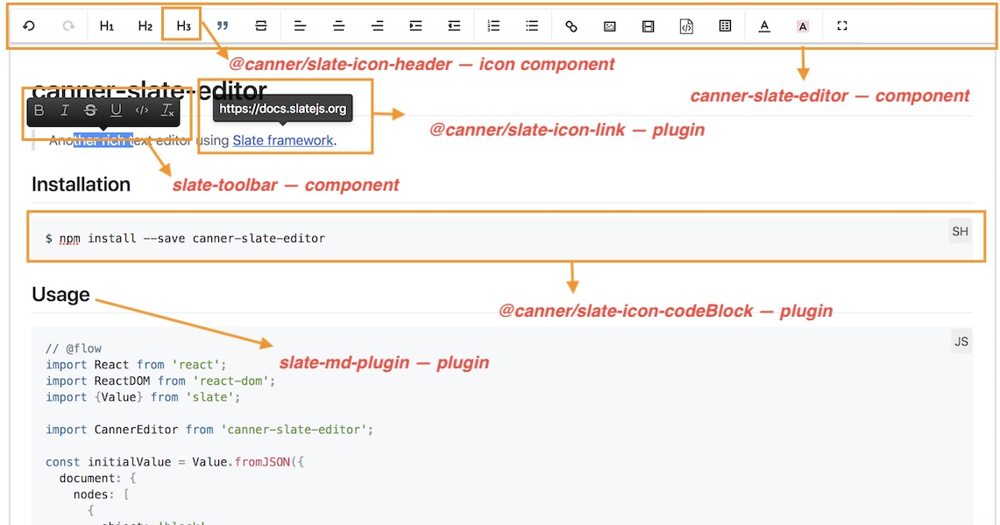
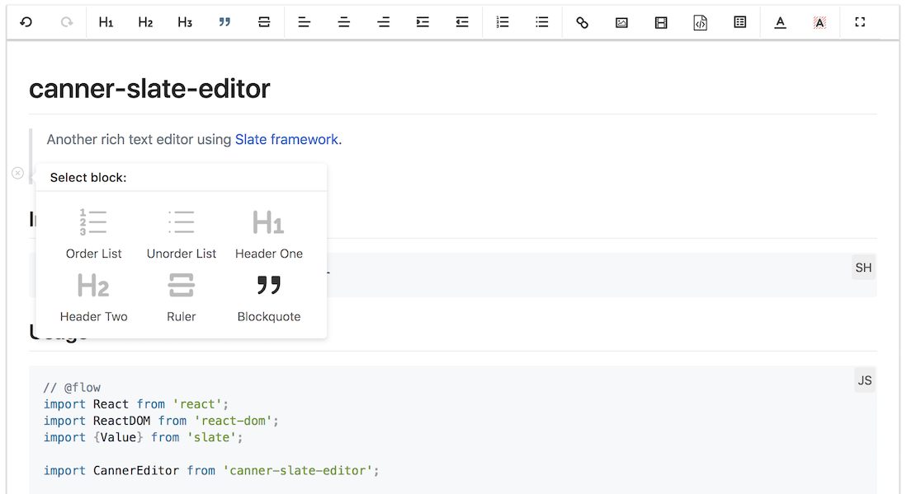

# canner-slate-editor [](https://lernajs.io/)

> 📝 Rich text / WYSIWYG editor focus on **modularity and extensibility**, build on top of [Slate framework](https://docs.slatejs.org) with beautiful designs and high-level APIs.
> ***This project is currently under heavy development***



***canner-slate-editor is a modulized editor, everything is a npm module! You could 100% compose to your personal usage!***

## Why not use Slate directly?

[`Slate`](https://github.com/ianstormtaylor/slate) is a well-designed powerful **editor framework** that helps you deal with difficult parts when building an editor, such as data modeling, updating states, rendering, editor schemas, serializing... (you could learn more [here](https://github.com/ianstormtaylor/slate#why)), while you are trying to build your own editors, it still need a lot of efforts to build a simple beautiful editor up and running with the framework.

This repository aims to provide complete editors and plugins solutions that allows you to use it right away, instead of digging through slate documentations and using our high-level components you could almost build editors without any slate framework knowledge to use.

## Why another editor?

There are many other rich text and WYSIWYG editors online, but as [slate - why section](https://github.com/ianstormtaylor/slate#why) mentioned that most of these solutions are

1. Not small and reusable
2. Hardcoded and hard to customize
3. Re-inventing the view layer seemed inefficient and limiting
4. ...

**Since this project is orignally started from [Canner](https://github.com/Canner/canner), we have some special use cases for our clients that most of the editors are hard to meet our requirements.**

Hence, this repository will try to keep all the advantages slate framework provides and create a more high level APIs for developers could also easily reuse and customize their own version of editor. Also we are always welcome to all kinds of contributors! 🙌

# Project structure

This projects currently contains over **47+ npm modules**, every features are packaged into npm modules, such as icons, helpers, plugins, utils, etc..., so this enable developers to pick modules to assemble into your own usages.

## 1. canner-slate-editor

> Another rich text editor using Slate framework, with beautiful design

Learn more [canner-slate-editor](./packages/editors/canner-slate-editor)




## 2. slate-md-editor

> A markdown editor, that allows you to edit live with hot keys support!

Learn more [slate-md-editor](./packages/editors/slate-md-editor)


## 3. slate-icons

> 20+ shared slate icons and helpers for Slate editors.

Learn more [slate-icons](./packages/slate-icons)

## 4. slate-selectors

> shared slate selectors for Slate editors.

Learn more [slate-selectors](./packages/slate-selectors)

## 5. quill-icons

> Icons extract from quill editor with React component wrapper, support 65+ icons!

Learn more [quill-icons](./packages/quill-icons)

## 6. slate plugins

> A set of slate plugins.

- [plugins](./packages/plugins)

## 6. slate-utils & slate-helpers

> A set of helper and utility functions for Slate editors

- [helpers](./packages/helpers)
- [utils](./packages/utils)
- [renderer](./packages/renderer)

## 7. slate-constant

> Share constants through repos.

Learn more [slate-constant](./packages/slate-constant)

# Development

We are using `yarn` workspace to manage all repos, learn more about [Yarn workspace](https://yarnpkg.com/blog/2017/08/02/introducing-workspaces/)

To install packages

```
yarn
```

See demos

```
npm start
```
